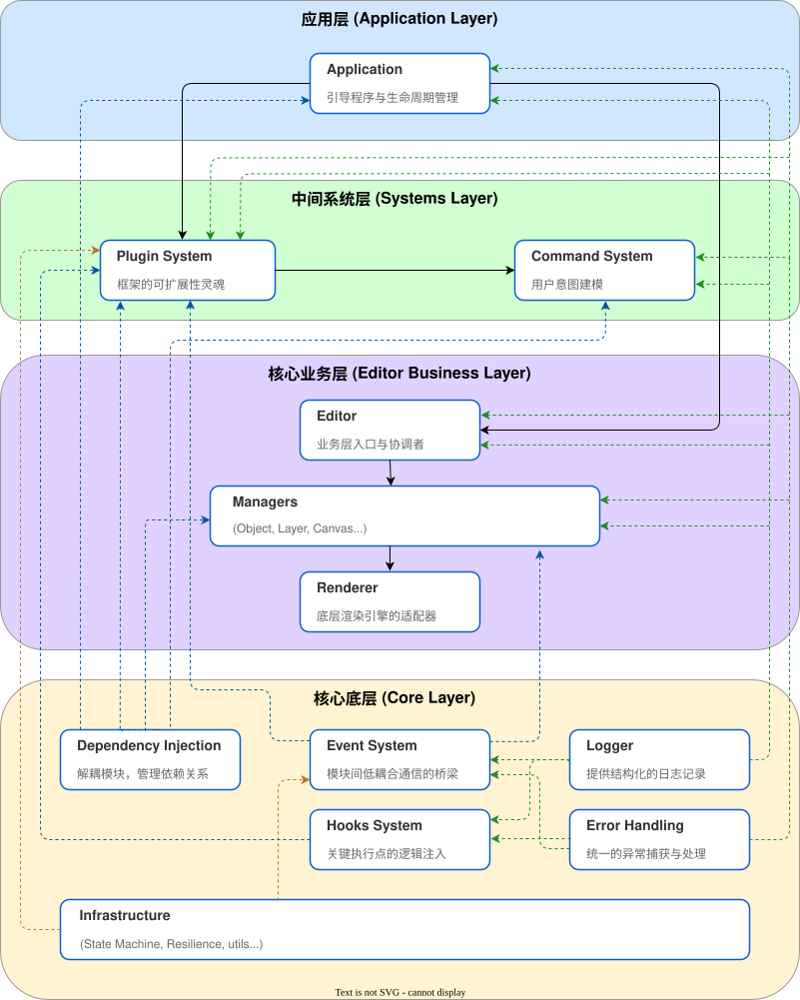

# 架构总览

FabricX Core 的设计哲学根植于**分层**、**模块化**与**可扩展性**。我们深知，构建一个复杂的、创造性的 Web 编辑器，其挑战不仅在于功能实现，更在于如何长期维持代码的可维护性、可测试性以及应对未来需求变化的灵活性。

本框架并非一个大而全的整体，而是一个由多个**高内聚、低耦合**的核心模块协同工作的精密生态系统。理解这些模块如何分层组织以及它们之间如何交互，是掌握 FabricX Core 的关键。

## 核心架构图

下图展示了 FabricX Core 的核心模块及其分层关系。箭头表示了模块之间的主要依赖或数据流方向，从底层基础能力到顶层应用引导，层次分明。

## 分层设计理念

FabricX Core 的架构可被清晰地划分为四个层次。这种分层设计确保了职责的单一性，并允许您在需要时替换或扩展任何一层，而不会对整个系统造成灾难性的影响。

### 1. 底层核心 (Core Layer) - “基石”

这一层提供了构建任何现代应用都不可或缺的、与具体业务完全无关的**基础能力**。它们是整个框架的“基石”，每一个模块都稳定、独立且经过充分测试。

* **依赖注入 (DI)**: 整个框架的**中枢神经系统**。它负责所有模块的实例化和依赖关系解耦，是实现可测试性和模块化的核心。
* **事件系统 (Event System)**: 提供了分层的事件总线，支持捕获、冒泡和中间件。它是模块间进行**低耦合通信**的桥梁。
* **钩子系统 (Hooks System)**: 提供了同步和异步的钩子，允许在关键执行点进行**逻辑注入和流程控制**，是插件系统实现强大扩展能力的基础。
* **日志 (Logger) & 错误处理 (Error Handling)**: 提供了结构化的日志和统一的错误处理机制，确保了应用的**可观测性和健壮性**。
* **基础设施 (Infrastructure)**: 包含了一系列生产级的底层工具，如**状态机**、**弹性策略**（重试/超时/缓存）和**高级数据结构**，为上层建筑提供稳定可靠的支撑。

### 2. 中间系统层 (Systems Layer) - “框架”

这一层基于底层核心，构建了**应用的行为框架和扩展机制**。它们定义了“如何组织业务逻辑”和“如何扩展功能”。

* **命令系统 (Command System)**: 将用户的每一次操作抽象为**可执行、可撤销**的命令对象。它不仅仅是功能的实现，更是**用户意图的建模**。通过中间件，可以轻松集成历史记录（撤销/重做）、权限验证等横切关注点。
* **插件系统 (Plugin System)**: 这是 FabricX Core **可扩展性的灵魂**。框架的核心功能本身就是由一系列内置插件构成的。它定义了清晰的插件生命周期，并与 DI 系统深度集成，允许开发者将任何新功能封装为独立的、可插拔的模块。

### 3. 核心业务层 (Editor Business Layer) - “心脏”

这一层是我们的编辑器**具体业务逻辑的实现**。它负责管理编辑器的所有状态和渲染。

* **编辑器 (Editor)**: 作为业务层的入口，负责管理其内部所有“管理器”(Managers) 的生命周期和协调工作。
* **管理器 (Managers)**: 一系列高内聚的服务，每个都负责编辑器的一个特定领域，例如：
  * `ObjectManager`: 管理所有画布对象的状态。
  * `CanvasManager`: 扩展 Fabric.js API。
  * `LayerManager`: 管理图层结构。
  * `SelectionManager`: 管理选中状态。
  * `ViewportManager`: 管理视口（缩放/平移）。
* **渲染器 (Renderer)**: 与底层渲染引擎（如 Fabric.js）交互的唯一出口，将上层管理器的状态变更**转化为实际的像素**。它封装了渲染的复杂性，使上层逻辑保持纯粹。

### 4. 应用层 (Application Layer) - “引导程序”

这是框架的最外层，也是最终用户与之交互的入口。

* **应用 (Application)**: 负责整个应用的**引导 (Bootstrap)** 和**生命周期管理** (`mount`, `unmount`, `destroy`)。它将用户提供的配置（如插件列表、全局服务）与框架的内置模块组装在一起，创建根注入器，并最终启动应用。它是连接开发者配置与框架内部世界的**总装配线**。

## 数据流：一次“删除对象”操作的生命周期

为了更具体地理解这些层如何协作，让我们追踪一次典型的用户操作：用户点击“删除”按钮，删除选中的对象。

1. **[UI 层 -> 应用层]**: 用户的点击事件触发了一个处理函数，该函数调用 `appContext.exec('object:delete')`。`ApplicationContext` 是顶层 `Application` 提供的与正在运行的应用交互的句柄。

2. **[应用层 -> 命令系统]**: `exec` 方法将调用请求转发给**命令系统 (Command System)** 的 `CommandExecutor`。

3. **[命令系统 -> DI 系统]**: `CommandExecutor` 找到已注册的 `ObjectDeleteCommand`，并**创建其实例**。在命令的 `execute` 方法内部，它将使用**依赖注入 (DI)** 系统提供的 `inject(ObjectManager)` 和 `inject(SelectionManager)` 来获取所需的服务。

4. **[命令系统 -> 核心业务层]**:
    * `ObjectDeleteCommand` 首先调用 `selectionManager.getActiveObjectIds()` 获取当前选中的所有对象 ID。
    * 然后，它遍历这些 ID，并调用 `objectManager.remove(id)`。

5. **[核心业务层内部]**:
    * `ObjectManager` 在其内部数据结构（如 Map）中移除该对象。
    * 它通过**事件系统 (Event System)** 派发一个 `ObjectRemovingEvent`，通知其他可能关心此事的模块（例如，图层面板的 UI 更新）。
    * 最后，`ObjectManager` 调用**渲染器 (Renderer)** 的 `requestRender()` 方法，请求更新画布。

6. **[核心业务层 -> 渲染引擎]**: `Renderer` 在下一个动画帧，调用底层渲染引擎（Fabric.js）的 `renderAll()` 方法，将 `ObjectManager` 的最新状态**绘制到屏幕上**。

通过这个流程，我们可以看到一次简单的操作是如何在各个层次之间清晰、单向地流动的。每个模块都只关心自己的职责，并通过 DI 和事件系统等底层机制进行解耦通信，最终构成了一个健壮、可维护的系统。
